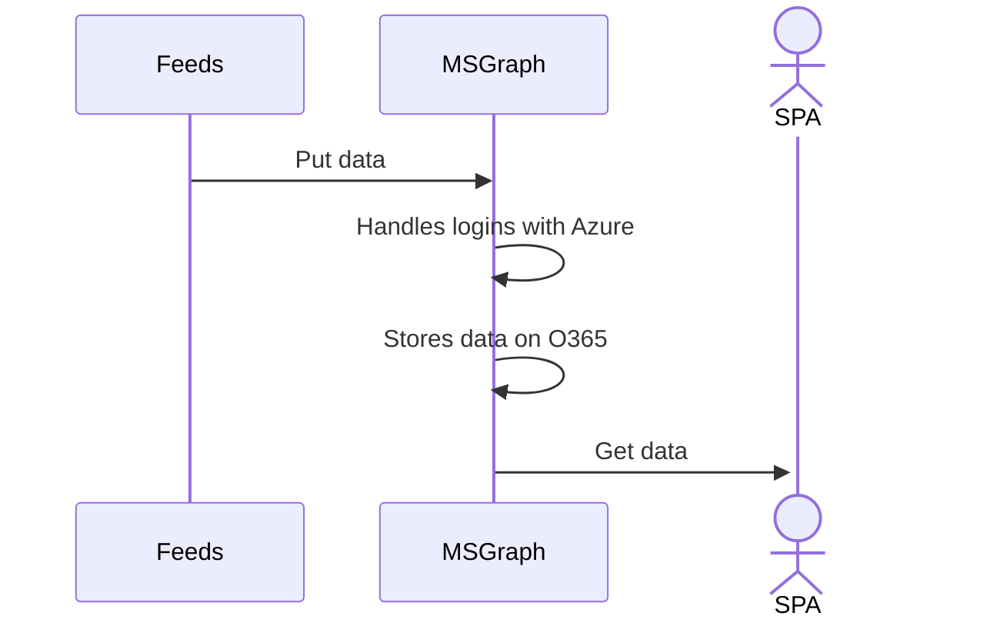

After moving all of our documents and our index into the cloud (Azure), I needed to create a UI to search the index and retrieve the blobs. This is a sort of diary of my experience building one. This takes place right after migrating the data, but they are somewhat disconnected efforts, so I wanted to split up these two tasks from a narrative perspective. Moving the data and keeping it safe was also a very different level of 'acceptable' vs what I wanted to accomplish with the UI, as will become evident as I record my thoughts on the process, I think.

_Edit: I happened to be departing my position where I created this while I was finalizing it, so the *main* goal became to keep it consistent with another project at work. To that end, I ended up initially implementing https://github.com/royashbrook/fuzzy-sniffle rather than anything else due to timing. It may be that something else will be done after some time, but a static site SPA is what went in initially as proof-of-concept, and that's what will be there until it's replaced. That being said, I thought it would be fun to just diary out the process as it's kind of similar to some past solution development processes._

## Prelude and Background

To recap, briefly, the current state of why this is happening, this system is going to replace an existing commercial document management system that has much more functionality. We have already have replaced that system with another offering, but we did not move the archive of what was in the old system, to the new system. We want to remove our dependency on the commercial software because we really just need to search the archive, so why not move the items into the cloud and search things there? The blob and index data have been moved to the cloud at this point, but we need a UI to search it.

The functional requirements are pretty simple:

1. Work similar to the previous system
2. Performance and Cost should be the same or 'better'.

This are my general guidelines for any system that needs to be replaced with an alternative. =)

On #1, this is relatively simple because the current user experience is pretty simple. Login, pick some type of document type filter and search by some fields (one or many) then click search and view results. Click a result to view/download a document. 


Well... first we have to build it, but the basic flow of the system. is pretty simple. =)

On #2, performance should be fine as this is pretty basic. Any weirdness can be solved with indexing, but I don't expect major issues because this is static data that doesn't update. And cost will just be lower because we won't pay for the software and all estimates show this will cost dollars per year, not thousands for our usage. On cost you may think 'oh... are you one of those labor is free people? because it still takes time to migrate!!!' and you would be right to ask that, but wrong on the labor is free. Although from a business perspective, they probably wouldn't worry about this in terms of prioritization, the reality is that this machine is running on some of our last bits of hardware to be removed from an old data center. We already had backups so the plan for some time has been 'if this physical machine breaks, we'll migrate to the new thing'. This is 'the new thing' in that description. The physical machine hasn't broken, but we are at the time to sunset it, so yay! In short, we can't 'do nothing' anyway because we need to empty the data center. =) So the 'labor is free' is more like the 'labor cost is already included' to some extent. 

So, now we know what to do functionally, but what do we build it on? React? Supabase is hot! Azure functions, lambda, blah blah? Well, for this I generally look at where I am now. I am a one man band for software work here currently, so I try not to stray too far from what we have. I don't want anyone who comes after me to have to maintain C, Java, Powershell, MS Flow jobs and GO or something. Even thought I'd love to write in as many languages as possible, it's just not a great stewardship of the environment one is in. Currently our environment for custom code consists of some legacy apps we wouldn't copy, dotnetcore apps, and sveltejs apps that use o365/msgraph for the service tier. All automated jobs are in powershell. SQL is all on azure for custom apps.

I have now introduced a couple of variables into the equation. A database in cosmos (although there is a copy in sql) and a set of blob data in azure storage. We have had blobs on azure storage for years, but only as a cool archive that is accessible by administrative staff, not something tied to an application where a user may have an error. Also no users access that needs to be audited, etc.

Some considerations for me, personally, as I work on this are that I could *probably* follow a very simple tutorial and built a blazor/wasm app in dotnet, which I have considered replacing some of our existing applications with. The other major option for me is implementing an app on sveltekit. I use sveltejs currently for one of our key internal applications, but I backend the services using some o365/msgraph magic and I think moving to a more 'traditional' setup with sveltekit would make more sense and provide a path to update the internal svelte app. This application is probably simple enough to provide some good proof-of-concept on both platforms and give some insight into how that would work.

Some additional details about the environment are that our users would be using azuread for authentication anyway, and likely using rbac in some way for authorization to the app. Possibly more on that later, but ironically our dotnet apps do not use azure auth, but our svelte spa app does. =) Plus our dotnet apps use sql for backends, and the svelte app uses o365/msgraph for it's data. This was more of an organic development than planned, but I think it provides a little color on the situation.

I think that's enough current state info. Now I'm going to just hop into a play-by-play of what I did.

_note: I wrote this prelude/background section after a few days of the play-by-play below, so there may be some recap or extra details about info here. But I wanted to leave it as I wrote it while I was doing it and creating a narrative around this process is what I was hoping to do._

_Edit: I also wrote all of this prior to accepting a new position, so some of my perspective is colored by my thoughts at the time. After making the decision to move on to a new opportunity, it made more sense to just go with the svelte option that was more aligned with recent work done, but when I started this process a 4-6 weeks prior that wasn't my head space._

## Day 1

Now that all of the data was uploaded, It was time to write some code to actually pull the data out and do some cleanup. To finally cleanup, I wiped the sql vm in the cloud and wiped the full backup duplicate azure sql database. I still have the replica of the id,k,v table on azure sql, but I at this point I expect to use cosmosdb for this purpose. I also still have an azure table with a small subset of the data for possibly doing some prototyping on. It is not as if we could *not* put data into azure tables slower, there just doesn't appear to be any value to it vs sql or cosmos so I'm not going to worry about it for now. Ideally, I'm hoping to just publish this solution on GitHub, but we'll see.

While I'm not 100% sure exactly what framework or platform I'm going to use, for starting I just wrote some node scripts to query the db, and then retrieve a file. The important packages for this were:

```
"@azure/cosmos": "^3.15.1",
"@azure/storage-blob": "^12.9.0",
```

I just followed the instructions for node.js on the MS site for doing the initial tests with these and fed in the queries with hand edits to test.

...time passes for prototyping and development.

## Day 2

I like sveltejs, so I am going to start with that. I am, generally, more of a microsoft fan, but I use svelte pretty regularly for a very frequently updated project day to day, and I have not moved it to svelteKIT yet, so I think I'll go with that. To start, anyway. Current options I'm considering:

1. dotnet core or blazor/wasm app
2. sveltekit
3. sveltejs or sveltekit in spa only mode
4. react/vue/angular (just because i haven't made one of these in a while)
5. something else...?

Microsoft stuff was top of mind since this is, for me, all running on azure services, but after writing my test node scripts I decided to just init a sveltekit project and see how that went. In general if I was using Firebase, or Supabase (lots of tutorials lately on that) I could just handle all of the access there, I think. But in my particular case I have users who have o365 access and I want to lock everything down with AzureAD. The document repo itself is only accessible to admins currently as the previous history retrivals were specific requests for a specific file from the old system. Now that we'll be creating a new index search app, why not tie it all together with MS auth and use the services available within azure?

To that end, I headed over to the cosmosdb, opened up IAM, then added some appropriate users as readers. This app has no 'write' requirement as it is just for searching the index so this is all we need.

I believe I need an app registration as well, so I go and create one over there I set the following things:

- single tenant, no implicit/hybrid stuff (don't click check boxes)
- platform config to SPA (for now)
- the redirect URI to localhost:3000 for now
- API permissions, user impersonation for cosmos and azure storage, grand admin consent

I did some fiddling on this throughout the day, but had to take care of some other things, so basically just got the sveltekit project stubbed out and got msal running and then plugged in some basic queries with env variables client side to test communication. Ran into some CORS issues to look into next.

## Day 3

I was able to get over the CORS issues by specifying any source. Using localhost didn't seem to work and I found a bug resolution on cosmosdb about this that indicated you could just disable the check. For now, I just set the allowed location to * because I'm hoping these queries will actually come from the SPA vs a specific API, but we'll see.

One key item for me was that our users typically just use the old system to search using what are called 'SavedInquiries' in doclink. These filter out the types of document types that will be shown.

I was able to get a basic prototype working where basically you logged in and hit a button and it would query some random collection of documents (of the appropriate type) from cosmos and display them along with a download button that you could click.

This is great, but I was not using the user's credentials directly, instead I was using the application/service keys and I wanted to really use the user's credentials and rbac for managing access. But this was just the initial prototype for a simple UI with some simple details, so at least the plumbing works.

As this only has limited users and no real 'roles' other than 'has access' I can just add the users directly to the app if desired, and then I could make sure all queries to get the data and blob happen on the server. This seems like the 'typical' way to do things, but I'd love to just have the users go straight to the service if I can from the client side and skip having a service tier to just relay data if possible.

We currently house some data on o365 and use msgraph for this purpose in another app and it works great. But msgraph doesn't appear to have a channel to just route to cosmos or sql. Maybe I can go through a data gateway and built some other service routing mechanism in o365 but I feel like that's just making things complicated at that point. The current o365/msgraph stuff works well because it's simple because the data is on sharepoint.

## Day 4 (but not calendar day 4 =P)

Off and on tasks bumped in front of this over the course of about a week somewhat stalling any changes. When I came back to things on a fresh monday, I was ready for a fresh start an decided I would just take a hard turn and spin up a blazor/wasm app to test things out that way. This day was mostly spent cleaning up the existing progress, bundling all of the updates/changes I had fiddled with into a PR on my repo, and putting together my planned next steps. Which *really* just amounted to 'make a blazor/wasm version of this'.

I'm on a pretty new macbook and I haven't installed dotnet tools on here yet! So this also gives me a chance to run through some of those steps that I did.

1. [Install dotnet of course!!](https://dotnet.microsoft.com/)

That's it. =P Dotnet installed!
```
Last login: Fri Apr 15 11:53:29 on ttys000
roy@work gh % dotnet --list-sdks
6.0.202 [/usr/local/share/dotnet/sdk]
```

I spent a lot of time on some apps that are based on business users changing data structures. To that end, I don't typically use typescript as I am normally shuffling data through generic table handlers or using basic table/row structures that I don't want to create types for. I could, but I haven't. However, I believe everything in blazor/wasm will require typing, so maybe I'll feel like switching to typescript after this. You never know!

I perform some basic steps to spin up something to open in vscode:

1. create a new folder in terminal, switch to it
2. dotnet new up an app like `dotnet new blazorserver -f net6.0`
3. setup loca git on this code with `git init && git add . && git commit -m "initial"`
4. open folder in vscode with `code .` _note: i previously already enabled this shortcut_
5. vscode asked me to install some dependencies and I clicked ok
6. open up terminal in vscode and run the app with `dotnet watch run`

Now we have a running app with some sample stuff in there. 🎉

Tomorrow, will be time to connect some dots on the blazor app.

## Day 5

Things I did:

- First thing I did was copy/paste the fetchdata page since I was going to want to fetch data, that seemed like a good place to start.
- Rename this page to something meaningful. I think rather than having a single page with 3 buttons, I am just going to have three pages in the blazor application so they'll just pick one from the left nav bar. I'll call this one Billing for now.
- Now that it's renamed, open up Billing.razor and change the `@page` line to use `billing` instead of `fetchdata`
- Open up shared/navmenu.razor and copy/paste the fetchdata link (or whatever you want) and update it to go to billing and have the right label.

Now the page shows up. 🎉

_note: I could also run a `dotnet` command to generate this, but i just copied it and will work that way for now.

Ran `dotnet dev-certs https --trust` and restarted app so I don't get warnings on local https.

Added `dotnet add package Newtonsoft.Json` so i can support handle cosmos data. It's right about here that I start to whistfully think about just using the old sql database and generating code. Sadly, it seems that cosmos doesn't support generating the model or any classes. So I just write a little sql code to generate this big class with newtonsoft decorations. Data output looks similar to this:

```csharp
namespace Data
{
  using Newtonsoft.Json;

  public class SearchResult
  {
    [JsonProperty(PropertyName = "1")] public string? x { get; set; }
    [JsonProperty(PropertyName = "2")] public string? y { get; set; }
    [JsonProperty(PropertyName = "3")] public string? z { get; set; }
    //etc etc x ~60 properties
```

Added `dotnet add package Microsoft.Azure.Cosmos` as that's... kinda key for cosmos data also =D I'm guessing I could go pure rest based, but the idea behind a blazor app, for me anyway, is just using the ms tools as they seem to be intended without a lot of 'creative' flare in the implementation. Keep it simple, as they say.

... some time plasses while I fiddle with things ...

While setting things up and looking at handling this, I came across [this](https://blog.jeremylikness.com/blog/azure-ad-secured-serverless-cosmosdb-from-blazor-webassembly/) article which seems to actually do *exactly* what I had intended to setup. Seeing it laid out like this, give me some pause as there are a lot of configuration steps that are required for the app to work this way. This isn't 'bad', but does make me concerned about the ability for anyone in our small operations team to troubleshoot anything with this and support it down the line. I'm not sure that there is another way to *really* work things the *right* way like this without those steps. but, maybe it's time for a more dramatic turn?

## Day 6 (ish?) - CHATBOT!

I'm sure the first question about this may be 'who tho?' and that's a valid question. The answers aren't too interesting. Remembering that this is an app for a small group of users (<20) our requirements on how it works and what is 'ok' is relatively easy to vet. So switching to a solution like this likely won't cause any disruption there. I don't think the cost will be signficantly higher based on what I've read. We also have had an interesting time getting the user population engaged in opening their mind about what types of applications can be built and getting something 'cool' like chat bot in place may generate some positive buzz that leads to additional citizen developer interest. Our users all utilize ms teams today, so this will probably count as something new and cool. Plus, I know our CIO will like a 'cool' implementation (and later confirmed this in a discussion with him). I had steered away from this thinking it would have more configuration points and probably a bit more complexity than a 'basic' app, but after looking at the setup on the article above, I think maybe I'm mistaken and it's similar.

I would have a different view if we had various teams who were creating systems like this on a regular basis, but we still have an app running that was written in 2006, so.... some things here have a long life. =) And if we are going to do something a bit more exotic, why not do something with some 'cool' points as well. =)

I have written some discord integration bots in the past, but it's been awhile. I think I may have also written a poc teams bot at some point, but I am not 100% sure on that and if so it was quite some time back. I did write some integration with ms communicator as well, but it's been... over 10 years for sure since I did that, so while I have some conceptual exposure, nothing practical for today's world and am largely starting fresh. =P

A little googling pointed me to https://dev.botframework.com/. Let's see what I did:

- Downloaded composer
- add it to applications folder so it could update. doesn't appear to work properly in the downloads folder. Not totally unexpected.
- Click create new and then pick an empty bot on c# platform. The others need some other resources, but I'm going to just poke around with this one first.

  


- I picked a web function as I don't think I need an entire app for this and I think I can just use triggers from teams for this. I'm going to name it Dale. Since I'm replacing a system called doclink, I abbreviate that as 'dla' quite frequently. I'm trying to name things a bit more interestingly lately, so we'll go with Dale.
  
  


- I got this, so I clicked Install:
  
  

- It just takes me to a web page for installing that. I use homebrew, so that's what I do:
  
  ```
  brew tap azure/functions
  brew install azure-functions-core-tools@3
  ```
  
- Go back and do the first few steps. Progress! 
  
  

- Composer opened up and I got the initial workflow. While clicking through the opening 'tips' I got this dialogue. I didn't install this, so I'm guessing I may need this as well. I opened up the download page, but didn't install it yet as I'm not really sure I need it yet. But since I'm not sure how to get back to these tips right now, I'll just save it. I'm not going to include the link here, but I'm sure searching for the bot emulator will show where to get it.
  
  
  
- After this, there was a getting started wizard on the right, I just clicked through those things in order. One of the first things I ran into was a publish wizard. Why not? Let's go =P Well, it was more creating a publishing profile. So I stepped through that. I have rights on Azure, so I signed in, selected my organization, and plugged in some info. 

  

- I also only included the required resources and unchecked all of the 'optional' resources. I *do* need access to cosmos and azure blob storage, but not for the bot to use, so I think I will add those later as I don't want this wizard to create some items for me. I think it's pretty unlikely that I'll need an S1 app service, but I'll just snag the default for now.

  
  
- Provisioning is 'partially complete' but looks like I still need to do some things.


- Unfortunately, that link didn't provide me with a _clear_ answer as there were a lot of issues. Simply searching for the answer online got me to an answer pretty quickly, however. Simply need to go to Subscriptions and pick the one I want in the azure portal. Then go to Resource providers, type bot, and pick the bot service and hit register.
  
  
  
- This took a few minutes to complete, then I headed back to the app. I clicked on a couple of other 'getting started' tasks before realizing that there seemed to be dialogue options or actions/buttons hidden by that dialogue on the right, so I closed that out. I went ahead and headed over to publish to see if I could get this thing out there! Sadly, 'twas not to be. My attempt to publish pulled this error, which I'm guessing is related to the previous registration. Now to see how to 'fix' it. Bummer, this is definitely something that I'd rather was a bit more turnkey. I'm worry about how a 'citizen developer' would go about troubleshooting these sorts of things.
  
  

- I thought maybe I could just go and 'edit' the profile before looking and see if re-walking the wizard would fix things.

  

  Unfortunately, this appeared to simply allow me to select some of the new optional resources and then maybe redeploy? I just cancelled out. I'm going to assume that this is just... I dunno something that didn't get setup properly because of the missing registration earlier. So I'm just going to wipe the resource group with these resources and start over.
  
- Creating the app with 'slightly' different values this time:

  

  That's more like it!
  
  

- Oddly, it seems like the name of my bot stayed the same and the profile stayed the same. I'm going to guess that this is because I'm probably working inside of some kind of project, and this is different than the resources that were provisioned on azure. While this is great because the name can stay the same, it's not really the expected behavior for me. But at least we're moving forward.

  
  
  Now we're cookin'! Or... well at least we seem to have some ingredients out to start cooking. =)
  
  
  
- So now I need to see how I can 'run' this bot. I click the 'start bot' button at the top right and I get an error. I imagine this is because I am missing those components I noted earlier. I downloaded the Bot Framework Emulator, and fired it up. It does not appear that this solved the issue for me, so will need a bit more research. Hitting 'start bot' again just kicks out the same error which is some type of framework issue I see details about x64 which isn't great since I'm on an M1 mac. Maybe this won't work on here. I'll have to check on the next day, which may not be tomorrow =P


## Day X, what's old is new again...


So, some time has passed as some other projects jumped in. As this keeps happening, I decided now was maybe a good time to get the prototype up and working that runs just like the initial app I had in mind when building this. I want to come back to the chatbot, but in the event of disaster, it would be good to get the fully functioning 'prototype' up and running so that we could consider the migration complete, and additional changes an improvement.

The downside (and the reason i haven't done this yet) is that once something is built, a lot of times there is little business incentive to improve or move it until it is required. And having something 'working' will likely be 'good enough' for a long time. I'm going to be optimistic though, and use the opportunity to create some better visibility into the way some custom internal sites currently work by packaging up the project templates and putting them out on public github. There's some value there as well, so no time lost.

At this point, if you aren't me, you have no idea what I'm talking about, so let's talk about the 'new' prototype based on something we currently use. This is the 'old' item referenced in my subtitle above. =P

Currently, one of our most used internal tools is a dashboard type of application. Technically speaking, it is a visualizer for some json data that is protected by AzureAD for logins and authorization. The flow basically looks like the diagram below.



_note: if you haven't, check out the github supported diagramming with [mermaid](https://mermaid-js.github.io)!_

This is pretty simple, but msgraph uses the app registration and authorization with azure ad currently to do the token exchange for a request to msgraph for a file on 0365 sharepoint which is where the data is stored. This is a simple solution that just allows us to provide access to AzureAD users which we can then lock down on the sharepoint folder in terms of access to what they can get data on. We can also version the files and pull multiple versions to make trends if desired. This is infrequently used, but it's an easy way to show trends over time without saving a table for that data since you can just pull it out via msgraph.

Firstly, I went ahead and created a blank of the project with the setup that I use currently. I haven't actually created a project template for it previously, so now seemed like a good time. I present [stunning-bassoon](https://github.com/royashbrook/stunning-bassoon)! Thank goodness for the random name generator, I am terrible with generating fun names and normally name these things something super boring like 't0'.

Now I want to add the auth and other sync details that I want, for that I'll create a new project based on stunning-bassoon named [laughing-barnacle](https://github.com/royashbrook/laughing-barnacle). I love these names. =) I'll probably just call this lb for short moving forward.

To stub this out, I'm going to create a new app on my personal azure setup just to test. I name it for lb and just add a localhost redirect for now.


You can find details on what to do next on the ms site [here](https://docs.microsoft.com/en-us/azure/active-directory/develop/single-page-app-quickstart?pivots=devlang-javascript).

I think this flow does a great job of showing the token flow for auth. You can imagine that this happens as soon as the user goes to the site, and then there is another set of 5 and 6 where the data we need is gotten. We send an additional get with the access token and get the response with the data from ms graph.


For me, I currently have users coming to the site and it triggers the auth immediately rather than having a login button. So I simply ran `npm i @azure/msal-browser --save-dev` and made some js changes to customize my setup. The details will be in the lb repo for this.


Now when I login, I get this:


and since I asked for the ability to read files for this client, I then get this prompt:


Now, in the case of my enterprise app, I just consent for the organization, and then I can check the azure ad logins for who is logging in. This is read only, so no real impacts for concurrency or whatever.


For me, I currently have users coming to the site and it triggers the auth immediately rather than having a login button. So I simply ran `npm i @azure/msal-browser --save-dev` and made some js changes to customize my setup. The details will be in the lb repo for this.

#### Day Z (who even knows at this point?)


_After the last update, I had a ton of tasks jump in front and interrupt about a week. Work on this was somewhat sporadic, but I took a lot of screenshots of the key things so I'm g_oing to just kind of include some running commentary as best I can below. =)_

Originally I tried to add this without a tenant. I had to give myself permission on graph while testing queries.


got a link to the file and shared that with my account, sans tenant.


Here's the email i got when i shared the file


And then I clicked and had to get a pin, and walk through this process prior to being able to open the file


emailed pin


this id looked like it might be the id to go with


registered lb in my personal tenant, but then switched it later over to personal option 3 with any org and include personal accounts. maybe i shouldn't say this is 'sans tenant' because really this was just skipping only using the tenant for auth, at least that was the plan.


configured some permissions to allow graph to get stuff


logging in with tenant, also have to grant for graph explorer


if you setup permission for tenant only and then try and login from some other dir using ms, you'll get an error like this when you try and login to the app. this is me logging into live, successfuly but failing to login to the app which is only registered to a tenant.


creating a site to hold the data on o365 sharepoint, it's private, but should note that even if it's private people with admin rights seem to still be able to access. i'm guessing there is a way to lock this down, but that wasn't a concern for me at the moment.


added myself anyway (as i didn't know it didn't seem to matter since i own everything)


originally i was testing with just a json file


but i switched over to a zipped json file when i starte to just mirror what i already had setup in my previous app setup


Figuring out the actual url to use to pull files is not the most straightforward thing. There may be some easier way to use it, but since we are going through graph anyway, I used graph explorer to search and get the data I wanted. I searched for driveitems and put in the file name that I know I want to see.


Then, in the results, there will be parent references


Using that, we can build out final query that we'll use to pull files from that folder.

`export const graphContentEndpoint = "https://graph.microsoft.com/v1.0/drives/b!UYlwtP7ji0euGnyoEVSB7CwNHVlEd-lFq0UFOjKo34eZk2vhVjpJTqRPC91hMyIA/items/01XMKSJ4SHY645HMG6HJGLAI3BNS2V3PRK/children?$select=name,lastModifiedDateTime,content.downloadUrl"`

We are just pulling down all of the data in that folder and will merge it all together into one big data object.

Now if I try and login to the site with a user from another org or who doesn't have rights, I get this:


Now, I currently don't have the application locked down in any way, so any user can *login* as long as they are in the organization. They'll get a token to try and use, but if they don't have access to the file, it won't matter. I created a test user just to trigger it and the browser just won't show the response data and will throw an error in the console like:


This all worked great. The final output of this was a test project that uses all of the components to integrate with o365 for the files. You can see the example code here:

https://github.com/royashbrook/laughing-barnacle

Now we need to add cosmos and blob storage.

## Captain's log, Stardate unknown...

Additional time passes. I decided to take a day to try and use the azure keyvault instead of using a file on azure. I will add some screenshots below and some narrative, but the TLDR; of this story is that you can't do this with a SPA app currently because Azure Keyvault does not allow CORS. So you have to create some kind of extra service to do this, which defeats the entire purpose of using a SPA (in my particular situation) anyway. But below is my journey to discovering this knowledge. =P What I ended up with is https://github.com/royashbrook/crispy-adventure an example project that pulled from a *LIST* on sharepoint for secrets. Similar to the file pull I ended up using, but, you know, there it is.


create a keyvault


select rbac


hit review and create to get the final page, hit create


created! hit go to resource


go to IAM and add a new role assignment


add myself


hit review and assign and wait for it to take effect a min, then head to secrets and create a new one


Let's create a new application for this demo:


let's add a permission for keyvault for this app:


grant admin consent!


Add myself as a keyvault secrets user:


I will truncate a lot of trial and error at this point. The bottom line is I realized that keyvault doesn't support cors, so that's the end of doing the azure vault. I think this is super silly that there is no cors for azure vault, but it is what it is. Blob storage and Cosmos and most other things in azure that I've ever tried all support cors, so I'm not sure why the vault doesn't, but .... /shrug. So anyway, moving on to storing the secrets on a secure list on sharepoint. I'll note here for anyone that thinks this is crazy that basically *ALL* of our business data is secured in this way on O365, so this isn't really any more or less secure than that. In an ideal world, I would probably switch to a service and secure it there, but currently this mimics some other apps we have setup internally, so sticking with this for consistencies sake.

create sharepoint site to hold the credentials


create a new list


open the list, click add column


click on 'new' and add an item


here's our secret...


I want to simply query this one record, so off to graph explorer to find all of my ids again:

let's search for my site


so our site id is appears to be `ashbrookio.sharepoint.com,5d8c920c-cd55-4c5e-be46-784c50e0dded,591d0d2c-7744-45e9-ab45-053a32a8df87`

so we can look at the lists on that site with

https://graph.microsoft.com/v1.0/sites/ashbrookio.sharepoint.com,5d8c920c-cd55-4c5e-be46-784c50e0dded,591d0d2c-7744-45e9-ab45-053a32a8df87/lists

and enumerate the items like

https://graph.microsoft.com/v1.0/sites/ashbrookio.sharepoint.com,5d8c920c-cd55-4c5e-be46-784c50e0dded,591d0d2c-7744-45e9-ab45-053a32a8df87/lists/secrets/items

or expand/limit the resposne with

https://graph.microsoft.com/v1.0/sites/ashbrookio.sharepoint.com,5d8c920c-cd55-4c5e-be46-784c50e0dded,591d0d2c-7744-45e9-ab45-053a32a8df87/lists/secrets/items/2?expand=fields(select=secret)

or if you want to query for it

https://graph.microsoft.com/v1.0/sites/ashbrookio.sharepoint.com,5d8c920c-cd55-4c5e-be46-784c50e0dded,591d0d2c-7744-45e9-ab45-053a32a8df87/lists/secrets/items?$filter=fields/Title eq 'secret1'&expand=fields(select=secret)

let's filter out some of the fields

https://graph.microsoft.com/v1.0/sites/ashbrookio.sharepoint.com,5d8c920c-cd55-4c5e-be46-784c50e0dded,591d0d2c-7744-45e9-ab45-053a32a8df87/lists/secrets/items?$filter=fields/Title eq 'secret1'&expand=fields(select=secret)&$select=id

this gives us a response sort of like this:


but... why torture ourselves, instead i can just unhide the 'id' column in the list so i know exactly what id i want to get, then i can skip using a custom field and just pull it by id like this:

https://graph.microsoft.com/v1.0/sites/ashbrookio.sharepoint.com,5d8c920c-cd55-4c5e-be46-784c50e0dded,591d0d2c-7744-45e9-ab45-053a32a8df87/lists/secrets/items/1?expand=fields(select=title)&$select=id

If you are searching, you'll want the second header below, regardless, you'll want to skip getting the odata meta data with the top one:


this will leave you with a nice clean'ish response like

```
{
    "id": "1",
    "fields": {
        "Title": "I'm secret with ID1!"
    }
}
```

I was not able to figure out a way from the documentation to get *just* the one field property that i wanted, but i could limit the properties to just the id and only expand the one field value using the query above. The documentation on the query parameters leaves quite a bit to be desired. I can't imagine there isn't a way to just tell the server 'give me only this property value' but this is where we are for now. =)

## Day 'The End', post-mortem, lessons learned, etc!

In the end, due to time constraints, I ended up:

- Using the same SPA structure that I was already using in some additional projects
  - This was the proof-of-concept setup, but it's going to be what's left in place for now
- Using O365 sharepoint to store the secrets in a file
- Using the same file/cache download method I was already using in some other projects

You can find this project template here:

https://github.com/royashbrook/fuzzy-sniffle

Basically throught this process I created the following projects:

- https://github.com/royashbrook/stunning-bassoon
  - A svelte based project template that represents the canned start for these types of projects for me currently
- https://github.com/royashbrook/laughing-barnacle
  - A variant of above project that addds in login to MS via MSAL.js and O365 integration via MSGraph
  - This serves as the real start of these types of projects because this is has the login and the file retrieval
  - Existing apps use this structure with agents that feed data to O365, then pull the data from there and essentially skin it
- https://github.com/royashbrook/crispy-adventure
  - Same as above, but pulls from a sharepoint list instead of a file
- https://github.com/royashbrook/musical-tribble
  - This is the output template project that connects all the dots
  - This project logs in to ms, gets keys from o365
  - Keys are used to search the index in cosmosdb, and then files are pulled from blob storage
- https://github.com/royashbrook/fuzzy-sniffle
  - This was the final implementation that contains the tailored version for 'production'
  - This contains customizations for the index derived fromd doclink
  - This also contains the tailored UI elements to make things easier, as well as the ability to save preferences to the browser

There were several other test projects that just ended up getting tossed. Notably the chat bot, the blazor/wasm app, and some other tailored test things that just got scrapped.

The final solution is quick and super cheap. I believe it's going to cost like 100 bucks a year or something including the storage. Obviously with more users, costs will scale somewhat as I am just hosting this on the free tier currently. Based on previous experience hosting some other internal apps on free tier, I don't expect that to be an issue but YMMV.

_Edit: I noticed after publishing this, that I didn't actually have any pictures of the application itself, which seems kind of unhelpful since no one can log into it and actually see it since it's secured with all of the MS stuff, so I'm adding some below._

If you try and login and you dont' have access, you get a blank screen and these messages in console.


If you login, you get this:


Under preferences you can modify which fields you want to show in the search/home page as well as which you want to show in the results.

When you search, it will return up to 15 results (normally this is a very targeted search and will only have a handful of documents) that looks like this:


The label up top is the 'document type' name from doclink. You can select in preference which document properties you want to show in this window as well.

It's very basic, but very functional. For the initial import I only went back to 2010 instead of as far back as I could go (2006) so the index was smaller, but still had over 9.3 million records. For all of my tests the search was sub 1 second, that's pretty good. You can game the system or create much more complex queries where you wildcard every field and it's slower, but I was always able to get a result even if it took a bit so not bad for nearly free. The system is also easily setup to have the UI modified, but I just ran out of time and done always wins out over not done. =)

I also realizes that I didn't note the hosting. On the initial deploy, I'm using azure static sites, but it's just a static site so it could be deployed anywhere, the CORS rules just have to be updated appropriately everywhere.